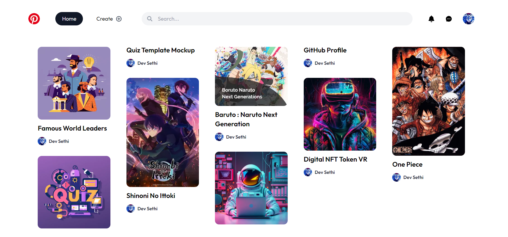
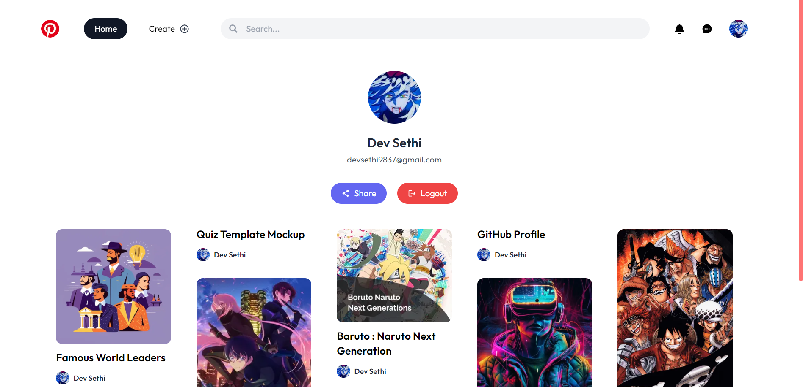
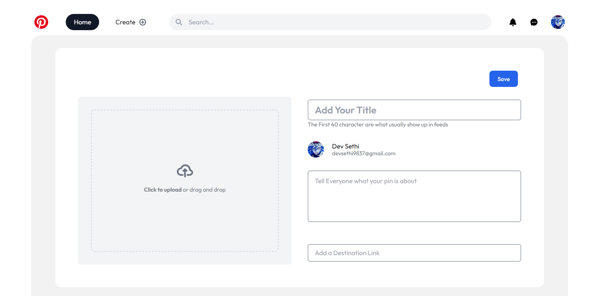
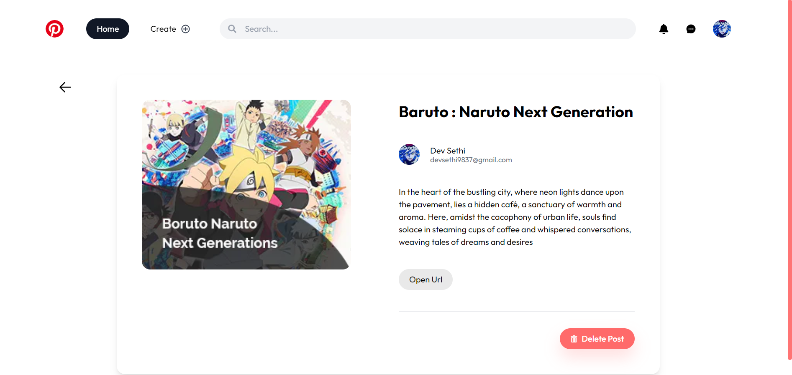
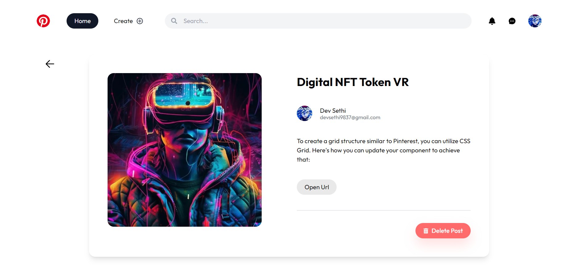

# Pinterest Clone with Next.js and Firebase

Welcome to the Pinterest Clone repository! This project is a Next.js-based web application designed to replicate the functionality of Pinterest. Built with Next.js and Firebase, it includes user authentication using NextAuth.js and allows users to upload images, create posts, and view them on their profile page. The modern UI design enhances the overall user experience, making it visually appealing and user-friendly.

Check out the live demo of the Pinterest Clone [here](https://next-js-pinterest-clone-7wid.vercel.app/).

## Preview

### 1. Showing All Posts on the Home Page



### 2. Personal Profile Page



### 3. Creating a Post



### 4. Deleting a Post



### 6. Single Post Page



## Features

- **User Authentication:** Login and register using NextAuth.js for secure authentication.
- **Post Management:** Create, view, and delete posts with image uploads.
- **Profile Page:** View user-specific posts and data on the profile page.
- **Modern UI Design:** Sleek layout and visually appealing design for an enjoyable user interface.

## Getting Started

To run the Pinterest Clone locally, follow these steps:

1. Clone the repository to your local machine:

   ```bash
   git clone https://github.com/Devsethi3/Next-JS-Pinterest-Clone .git
   ```

2. Navigate to the project directory:

   ```bash
   cd pinterest-clone
   ```

3. Install the dependencies:

   ```bash
   npm install
   ```

4. Start the development server:

   ```bash
   npm run dev
   ```

5. Open your web browser and visit [http://localhost:3000](http://localhost:3000) to use the app.

## Usage

1. Login or register using the authentication feature.
2. Explore all posts on the home page.
3. Click on the "Create Post" button to upload a new image and create a post.
4. Click on a post to view it in detail or delete it if needed.
5. Visit the profile page to view your user-specific posts and data.

## Customization

Feel free to customize this project to fit your preferences. Update styles, colors, and layout in the Next.js components and CSS files. You can also extend the functionality to include additional features or customization options.

## Contributing

If you'd like to contribute to this project, please follow these steps:

1. Fork the repository.
2. Create a new branch for your feature or improvement.
3. Make your changes and commit them with descriptive messages.
4. Push your changes to your forked repository.
5. Open a pull request to merge your changes into the main branch.

Explore the Pinterest Clone, share and discover images, and consider contributing to its development. Thank you for checking out the repository!
